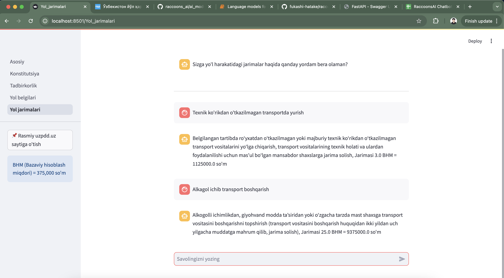

# Raccoons AI 
Project name: AI based Law advisor. 

Project Description: Chatbot that can answer questions related to Constitution of Uzbekistan, laws about business and traffic rules. Additionally, you can upload images of traffic sign and get immediate answer about what kind of sign it is and rules related to this sign. 


Used language models: 
- Mini BERT (Bidirectional Encoder Representations from Transformers) 

Used Computer Vision models: 
- MobileNetV2 on Pytroch (https://pytorch.org/hub/pytorch_vision_mobilenet_v2/)

Used API: 
- Fast API (https://fastapi.tiangolo.com/)

Web page: 
- Streamlit library in Python (https://streamlit.io/)

Telegram bot: 
- aiogram (https://aiogram.dev/)

***
How to use: 

Clone our repo and install requirements: 

```console
pip install -r requirements.txt
```

API: 
```console
fastapi dev api/main.py
```

Website: 
```console
streamlit run chat_web/Asosiy.py
```

Telegram: 
```console
python telegram_bot/AIbot.py
```

*** 

### DEMO 

Konstitutsiya haqida savollar: 

  

Tadbirkorlikga oid savollar: 

 

Yo'l harakatidagi jarimalar savollar: 

  

Yo'l belgilariga oid savollar:

 
